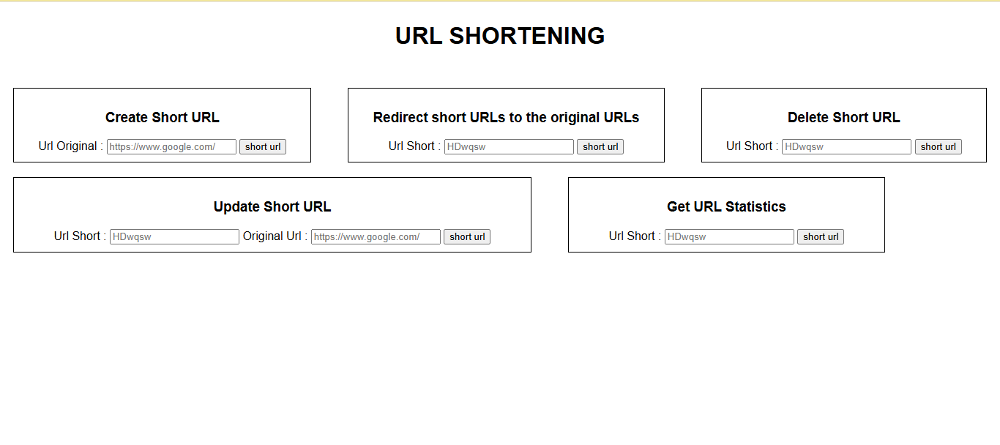

# URL Shortening Service

This project allows users to shorten a long URL and redirect to the original URL using its short code.  
Users can create, retrieve, update, and delete short URLs.  
Additionally, users can view statistics about how many times a short URL has been accessed.

## TECH STACK

### BACK END

- Node.js
- Express.js
- MySQL2
- Nanoid

### FRONT END

- Vanilla JavaScript
- HTML
- CSS

## USAGE

This section documents the main API endpoints, including required parameters, request bodies, and example responses.

You can interact with the API using tools such as Postman or through the provided simple UI.



### Create Short URL

Create a new short URL
Endpoint : POST /shorten

Request body:

```
{
"url": "https://www.example.com/some/long/url"
}
```

Response:

```
{
"id": "1",
"url": "https://www.example.com/some/long/url",
"shortCode": "abc123",
"createdAt": "2021-09-01T12:00:00Z",
"updatedAt": "2021-09-01T12:00:00Z"
}
```

### Retrieve Original URL

Retrieve the original URL from a short URL
Endpoint: GET /shorten/abc123

Response:

```
{
"id": "1",
"url": "https://www.example.com/some/long/url",
"shortCode": "abc123",
"createdAt": "2021-09-01T12:00:00Z",
"updatedAt": "2021-09-01T12:00:00Z"
}
```

### Update Short URL

Update an existing short URL
Endpoint: PUT /shorten/abc123

Request body:

```
PUT /shorten/abc123
{
"url": "https://www.example.com/some/updated/url"
}
```

Response:

```
{
"id": "1",
"url": "https://www.example.com/some/updated/url",
"shortCode": "abc123",
"createdAt": "2021-09-01T12:00:00Z",
"updatedAt": "2021-09-01T12:30:00Z"
}
```

### Delete Short URL

Endpoint: DELETE /shorten/abc123

### Get URL Statistics

Endpoint: GET /shorten/abc123/stats

Response:

```
{
"id": "1",
"url": "https://www.example.com/some/long/url",
"shortCode": "abc123",
"createdAt": "2021-09-01T12:00:00Z",
"updatedAt": "2021-09-01T12:00:00Z",
"accessCount": 10
}
```
